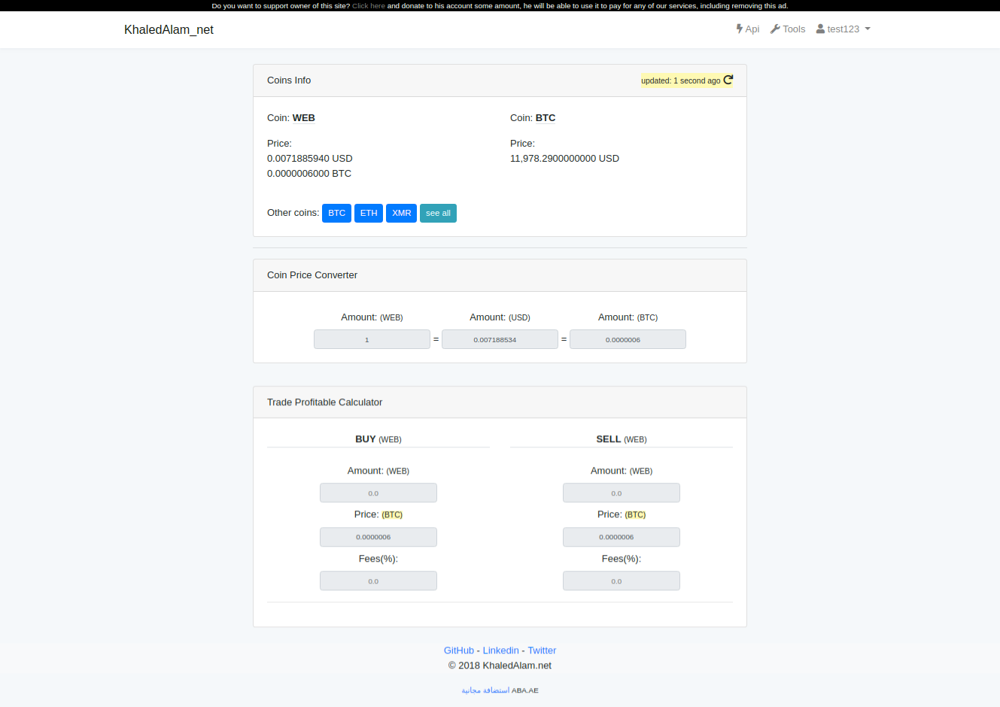
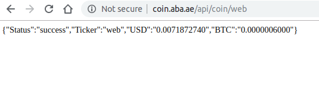

website:  http://coin.aba.ae  
username: test123  
password: test123  

Tool ex.  
http://coin.aba.ae/tools/coin/WEB

 

API ex.  
http://coin.aba.ae/api/coin/web
 

---------

## About Laravel

Laravel is a web application framework with expressive, elegant syntax. We believe development must be an enjoyable and creative experience to be truly fulfilling. Laravel attempts to take the pain out of development by easing common tasks used in the majority of web projects.

## License

The Laravel framework is open-sourced software licensed under the [MIT license](https://opensource.org/licenses/MIT).
